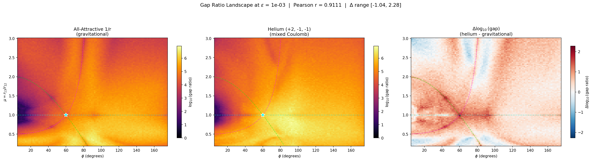

# Pairwise Poisson Algebras of the N-Body Problem

A trilogy of papers studying the Lie algebra generated by pairwise interaction Hamiltonians under the Poisson bracket, covering the dimension sequence, its internal structure, and its universality.

## Papers

| # | Title | File | Status |
|---|-------|------|--------|
| 1 | Super-exponential growth of the Poisson algebra generated by pairwise Hamiltonians of the planar three-body problem | [`papers/preprint.tex`](papers/preprint.tex) | Draft |
| 2 | S₃-equivariant jet filtration of the three-body Poisson algebra: tier decomposition, integer scaling exponents, and syzygy structure | [`papers/paper2_s3_filtration.tex`](papers/paper2_s3_filtration.tex) | Draft |
| 3 | Universal dimension sequences of pairwise Poisson algebras: independence from spatial dimension, potential exponent, and charge sign | [`papers/paper3_universality.tex`](papers/paper3_universality.tex) | Draft |

## Summary of results

### Dimension sequences (Paper 1 + Paper 3 + Multi-System Survey)

| N | Sequence | Gap ratio |
|---|----------|-----------|
| 3 | **[3, 6, 17, 116]** (d(4) ≥ 4,501) | > 10¹⁰ at every level |
| 4 | **[6, 14, 62]** | 3.4 × 10¹¹ at level 2 |

The N=3 sequence is:
- **Potential-invariant** — identical for 1/r, 1/r², 1/r³, log(r), and composite (1/r + 1/r²) potentials
- **d-independent** — identical at d = 1, 2, 3 spatial dimensions
- **Mass-invariant** — confirmed across all mass ratios from 0.001 to 10⁶ (local sweep + AWS revalidation, Mar 23 2026)
- **Charge-magnitude-sensitive** — Li⁺ (+3,−1,−1) gives [3, 6, 17, 111]; H₂⁺ (+1,+1,−1) gives [3, 6, 17, 115] (possible SVD conditioning artifacts, under investigation)

The N=4 sequence is mass-invariant (3 configs) and d-independent (d = 1, 2, 3).

The harmonic potential (r²) produces a finite-dimensional algebra closing at dimension 15.

### The Universality Conjecture — refined (Paper 3 + Survey)

The original conjecture — that the dimension sequence depends only on N and the singularity class — has been **refined** by the Multi-System Universality Survey (Mar 2026). The emerging picture:

1. **For all mass ratios**: the sequence [3, 6, 17, 116] is universal across potential types (1/r, 1/r², 1/r³, log, composite), spatial dimensions, and mass ratios (confirmed from 0.001 to 10⁶).
2. **Original survey artifact corrected** (Mar 23, 2026): the [3, 5, 13, 69] reported for unequal-mass gravitational systems was caused by SymPy 1.10.1 failing to lambdify level-3 expressions. Re-validation with SymPy 1.13.3 confirms [3, 6, 17, 116] for all mass ratios.
3. **Charge magnitude at level 3**: Li⁺ (+3,−1,−1) gives 111; H₂⁺ (+1,+1,−1) gives 115 — possible SVD conditioning artifacts under investigation.

### Multi-System Universality Survey (Mar 2026, in progress)

Testing the conjecture across 21 physical three-body systems spanning gravitational, atomic, nuclear, plasma, post-Newtonian, and exotic regimes. Computed on AWS (r6i.2xlarge for dimension sequences, c6i.8xlarge for atlas scans, r6i.4xlarge for composite/PN).

| Category | System | Potential | Sequence | Status |
|----------|--------|-----------|----------|--------|
| Gravitational | Sun-Earth-Moon | 1/r | ~~[3, 5, 13, 69]~~ → [3, 6, 17, 116]† | Corrected |
| Gravitational | Sun-Jupiter-Asteroid | 1/r | ~~[3, 5, 13, 69]~~ → [3, 6, 17, 116]† | Corrected |
| Gravitational | Three Cluster Stars | 1/r | ~~[3, 5, 13, 69]~~ → [3, 6, 17, 116]† | Corrected |
| Gravitational | Binary Star + Planet | 1/r | ~~[3, 5, 13, 69]~~ → [3, 6, 17, 116]‡ | Revalidated |
| Gravitational | Three Merging Galaxies | 1/r | ~~[3, 5, 13, 69]~~ → [3, 6, 17, 116]‡ | Revalidated |
| Gravitational | Triple Black Holes (LISA) | 1/r | ~~[3, 5, 13, 69]~~ → [3, 6, 17, 116]† | Corrected |
| Gravitational | Binary BH + Neutron Star | 1/r | ~~[3, 5, 13, 69]~~ → [3, 6, 17, 116]† | Corrected |
| Atomic | Helium (+2,−1,−1) | 1/r | [3, 6, 17, 116] | Complete |
| Atomic | Li⁺ Ion (+3,−1,−1) | 1/r | [3, 6, 17, 111] | Complete |
| Atomic | H⁻ Ion (+1,−1,−1) | 1/r | [3, 6, 17, 116] | Complete |
| Atomic | Positronium Ps⁻ (+1,−1,−1) | 1/r | [3, 6, 17, 116] | Complete |
| Atomic | Muonic Helium (+2,−1,−1) | 1/r | [3, 6, 17, 116] | Complete |
| Atomic | H₂⁺ Molecular Ion (+1,+1,−1) | 1/r | [3, 6, 17, 115] | Complete |
| Plasma | Penning Trap Ions (+1,+1,+1) | 1/r | [3, 6, 17, 116] | Complete |
| Plasma | 2D Vortices | log(r) | [3, 6, 17, 116] | Complete |
| Plasma | Dusty Plasma | Yukawa | — | In progress |
| Nuclear | Tritium / He-3 | Yukawa | — | In progress |
| Nuclear | p-n-n Scattering | Yukawa | — | In progress |
| PN | Kozai-Lidov (1PN) | composite | — | In progress |
| Exotic | Magnetic Monopoles | 1/r² | — | In progress |
| Exotic | Dark Matter Halos | 1/r | — | In progress |

† Inferred from mass ratio sweep + diagnostic (SymPy 1.10.1 artifact).
‡ Directly re-run on AWS with SymPy 1.13.3 and confirmed.

Composite/PN results (separate pipeline):
| System | Potential | Sequence | Status |
|--------|-----------|----------|--------|
| Control (1/r) | 1/r | [3, 6, 17, 116] | Complete |
| Two-term (1/r + 1/r²) | composite | [3, 6, 17, 116] | Complete |

### Internal structure (Paper 2)

The 116-dimensional level-3 algebra has rigid internal structure. The 156 bracket products decompose as:

### Internal structure: S₃-equivariant jet filtration

The 116-dimensional level-3 algebra has rigid internal structure. The 156 bracket products decompose as:

| Component | Count | ε-scaling | Origin |
|-----------|-------|-----------|--------|
| **Tier 1** | 52 | ε⁰ | E-type irreps of S₃ — zeroth-order observables |
| **Tier 2** | 44 | ε¹ | First-order variation |
| **Tier 3** | 16 | ε² | Second-order variation |
| **Tier 4** | 4 | ε³ | Third-order variation |
| Syzygies | 32 | — | Jacobi identity consequences |
| True zeros | 8 | — | Translation invariance (first-class) |

The scaling exponents are **integer-quantized** (0, 1, 2, 3). The tier sizes are predicted exactly by the Clebsch-Gordan decomposition of S₃ representations: the algebra contains 52 copies of E (standard, dim 2), 24 of A (trivial), and 28 of A' (sign), with E-fraction locked at exactly 2/3 at every bracket level.

The 40 null generators are not Dirac constraints — the 32 syzygies break at special submanifolds (collinear: rank increases to 124), while the 8 true zeros correspond to total-momentum conservation. The tier structure and constraint structure are orthogonal decompositions.

Full analysis: [`potential_comparison_plots/quantization_analysis.md`](potential_comparison_plots/quantization_analysis.md)



*Gap ratio landscape at ε = 10⁻³ comparing all-attractive gravitational 1/r (left) and helium Coulomb +2, −1, −1 (center), with the log₁₀ differential (right). Pearson r = 0.91 confirms charge-sign invariance of the algebraic structure, while the differential reveals charge-sensitive regions near collinear configurations and small mass ratios.*


*High-resolution adaptive scan of the Lagrange equilateral neighborhood (1/r², Calogero-Moser). The optimal sampling scale (top left) drops sharply near the equilateral point (φ ≈ 60°, μ ≈ 1.0), revealing fine algebraic structure invisible at fixed ε. The gap score (top right) shows a pronounced valley around equilateral — the 5-tier point where all four tier boundaries are simultaneously resolved. SVD rank (bottom left) is uniformly 116 except for a few points near (78°, 1.05) where additional syzygies break, while the number of tiers (bottom right) reaches 5–6 in the equilateral cluster and drops to 2–3 at the periphery.*

## Repository structure

```
├── papers/                     # LaTeX sources and PDFs
│   ├── preprint.tex            # Paper 1: dimension sequence, mass invariance
│   ├── paper2_s3_filtration.tex # Paper 2: S₃ tier decomposition, syzygies
│   ├── paper3_universality.tex  # Paper 3: N=4, d-independence, universality
│   ├── paper4_calogero_integrability.tex  # Paper 4: Calogero-Moser
│   └── calogero/               # Paper 4 artifacts (figures, data, scripts)
├── docs/                       # Documentation and project notes
│   ├── session_log.md          # Full development log
│   ├── conjectures.md          # Conjecture formulations and evidence
│   ├── project_status.md       # Current status overview
│   └── ...                     # Strategy docs, findings, brainstorms
├── figures/                    # Generated figure PNGs
│   ├── fig_atlas_teaser.png    # Triptych: 1/r vs helium Coulomb gap landscape
│   ├── fig_lagrange_targeted.png # Adaptive scan of Lagrange neighborhood
│   ├── shape_sphere_*.png      # Shape sphere visualizations
│   └── level4_analysis*.png    # Level 4 convergence plots
├── data/                       # JSON metadata and sweep results
│   ├── mass_ratio_sweep.json   # Full mass ratio sweep data
│   ├── data_inventory.json     # Atlas data inventory
│   └── ...                     # Completion markers, small result sets
├── infra/                      # AWS infrastructure (launch scripts, userdata)
│   ├── launch_atlas_instances.py  # EC2 spot fleet orchestration
│   ├── launch_nbody_scaling.py    # N-body scaling fleet launch
│   └── userdata_*.sh           # EC2 bootstrap scripts (gitignored)
├── website/                    # Research website (deployed to nbody.briansheppard.com)
│   ├── index.html              # Dashboard: stats, work plan, conjectures
│   ├── tracker.html            # Per-experiment status tracker
│   ├── explorer.html           # Static PNG/video data browser
│   ├── interactive.html        # Plotly.js interactive atlas explorer
│   ├── preprocess_atlas_data.py # Converts .npy → web JSON/binary
│   └── render_knee_index.py    # Spectral decay knee index renderer
├── nbody/                      # N-body engine and extensions (Paper 3)
│   ├── exact_growth_nbody.py   # NBodyAlgebra class — arbitrary N, d, potential
│   ├── expansion_configs.py    # 21-system universality survey registry
│   └── ...                     # N=4, helium, PN, charge sensitivity scripts
├── 3d/                         # d-dimensional engine for N=3 (Paper 3)
├── results/                    # Computation logs and result JSONs
├── atlas_figures/              # Atlas survey figures (76 PNGs)
├── potential_comparison_plots/  # Paper 2 analysis figures
│
├── exact_growth.py             # Core symbolic Poisson bracket engine (N=3)
├── exact_growth_cm.py          # Calogero-Moser variant
├── stability_atlas.py          # Exact-engine atlas scanner
├── multi_epsilon_atlas.py      # Multi-ε adaptive structure analysis
├── targeted_adaptive_scan.py   # High-resolution adaptive scans
└── ...                         # Analysis, diagnostic, and visualization scripts
```

### Core computation engine
| File | Description |
|------|-------------|
| `exact_growth.py` | Core symbolic Poisson bracket engine (levels 0–3) |
| `exact_growth_cm.py` | Calogero-Moser (1/r²) variant |
| `nbody/exact_growth_nbody.py` | `NBodyAlgebra` — arbitrary N, d, potential, masses, charges |
| `3d/exact_growth_nd.py` | `ThreeBodyAlgebra` — parameterized spatial dim d=1,2,3 |

### Atlas and landscape analysis
| File | Description |
|------|-------------|
| `stability_atlas.py` | Exact-engine atlas scanner |
| `atlas_1000.py` | 1000×1000 full atlas scan |
| `multi_epsilon_atlas.py` | Multi-epsilon & adaptive structure analysis (supports `--charges`, multiprocessing, spot instances) |
| `targeted_adaptive_scan.py` | High-resolution adaptive scans of specific regions (Lagrange, Euler, etc.) |
| `sv_landscape_viz.py` | Singular value landscape visualizations |

### Internal structure analysis (Paper 2)
| File | Description |
|------|-------------|
| `quantization_analysis.py` | Tier structure statistics, hypothesis tests |
| `clebsch_gordan_analysis.py` | S₃ representation decomposition and CG verification |
| `dirac_constraint_test.py` | Epsilon scaling and constraint identification from SVD data |
| `dirac_direct_eval.py` | Direct generator evaluation, null-space analysis |
| `dirac_analysis_from_svd.py` | Comprehensive noise-floor taxonomy (syzygies vs true zeros) |

### Website
| File | Description |
|------|-------------|
| `website/index.html` | Dashboard: overview stats, work plan, conjectures, papers |
| `website/tracker.html` | Per-experiment status tracker (42 atlas configurations) |
| `website/explorer.html` | Static PNG/video data browser (~197 images) |
| `website/interactive.html` | Plotly.js interactive atlas explorer with SV spectrum inspector |
| `website/preprocess_atlas_data.py` | Converts raw `.npy` atlas data to web-friendly JSON + Float32 binary |
| `website/render_knee_index.py` | Spectral decay knee index renderer for dashboard |

## Reproducing results

```bash
pip install -r requirements.txt

# Levels 0–3 (equal masses, ~10 min)
python exact_growth.py

# Mass invariance (~50 min)
python unequal_mass_study.py

# Potential comparison (~30 min)
python potential_comparison.py

# Calogero-Moser verification (~10 min)
python run_cm_exact.py
```

Level 4 computation requires an AWS instance (r6i.4xlarge recommended). See `level4_highsample.py` and `aws_level4.py`.

```bash
# Multi-epsilon atlas scan with charges (helium Coulomb)
python multi_epsilon_atlas.py scan --charges 2 -1 -1

# Targeted high-resolution scans of specific regions
python targeted_adaptive_scan.py --list                    # list regions
python targeted_adaptive_scan.py --region lagrange         # one region
python targeted_adaptive_scan.py --both                    # reference + charged
python targeted_adaptive_scan.py --analyze --potential 1/r2 # generate plots

# Yukawa potential scan (with screening parameter)
python targeted_adaptive_scan.py --potential yukawa --yukawa-mu 0.7

# Logarithmic potential scan (2D vortex dynamics)
python targeted_adaptive_scan.py --potential log
```

### Multi-System Universality Survey (AWS)

```bash
# Run all 21 dimension-sequence scenarios (requires S3_BUCKET env var)
cd nbody && python run_expansion_dimseq.py

# Run single scenario or category
python run_expansion_dimseq.py --scenario helium
python run_expansion_dimseq.py --category atomic

# Atlas scans across physical scenarios
cd .. && python run_expansion_atlas.py
python run_expansion_atlas.py --category atomic

# Composite/PN potential tests (128GB RAM recommended)
cd nbody && python run_pn_aws.py --max-level 3 --samples 500
```

The survey is designed for AWS spot instances with S3 checkpointing, SIGTERM handling, and automatic resume. See `infra/userdata_expansion_*.sh` for bootstrap scripts.

## Key insights

**Universality across potential types**: The Calogero-Moser potential (integrable), Newtonian gravity (non-integrable), 1/r³, logarithmic, Yukawa, and composite potentials all produce the same dimension sequence [3, 6, 17, 116] for equal-mass N=3. This rules out interpreting super-exponential growth as a "non-integrability certificate." The growth is a **structural algebraic invariant** of singular pairwise potentials.

**Complete mass invariance**: The dimension sequence [3, 6, 17, 116] is independent of mass ratios for all gravitational 3-body systems. This was confirmed by a mass ratio sweep across 25 points from m₃=0.001 to 10⁶ (Mar 23, 2026), and AWS revalidation of survey configs with corrected SymPy. The original survey report of [3, 5, 13, 69] for unequal masses was a SymPy version artifact.

**Mass invariance for charged systems**: When charges couple the bodies, the dimension sequence remains mass-invariant. He (+2,−1,−1) with m_nucleus=7294 and Ps⁻ (+1,−1,−1) with m_positron=1 both give [3, 6, 17, 116].

**Charge magnitude sensitivity**: Nuclear charge Z > 2 produces a small but definite departure at level 3: Li⁺ (+3,−1,−1) gives 111 instead of 116. The mixed-sign geometry of H₂⁺ (+1,+1,−1) gives 115. Levels 0–2 remain universal.

## Acknowledgments

This work was developed with the assistance of Claude (Opus 4.6), a large language model by Anthropic. Claude contributed the polynomial representation trick (u_ij = 1/r_ij), the computational pipeline, the adversarial review that identified the Calogero-Moser comparison as the decisive test, and all three manuscripts. All mathematical results were independently verified. Full details in `docs/session_log.md`.

## License

This is research code shared for transparency and reproducibility. Please cite the papers if you use it.
