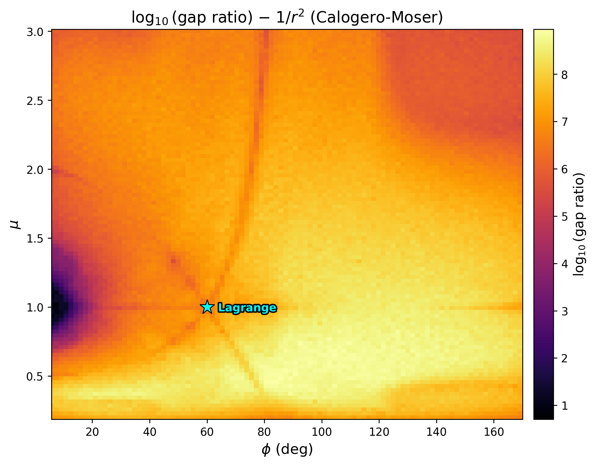

# Super-Exponential Growth of the Poisson Algebra in the Planar Three-Body Problem

The pairwise Hamiltonians of the planar gravitational three-body problem generate an infinite-dimensional Poisson algebra whose dimension grows super-exponentially with bracket depth:

| Level | Dimension | New generators | Growth ratio |
|-------|-----------|----------------|--------------|
| 0     | 3         | 3              | —            |
| 1     | 6         | 3              | 2.0×         |
| 2     | 17        | 11             | 2.8×         |
| 3     | 116       | 99             | 6.8×         |
| 4     | ≥ 4,501   | ≥ 4,385        | ≥ 38.8×      |

The sequence **[3, 6, 17, 116]** is:
- **Mass-invariant** — identical across generic mass configurations, including Tsygvintsev exceptional cases
- **Potential-invariant** — identical for Newtonian (1/r) and Calogero-Moser (1/r²) potentials
- **Charge-sign-invariant** — identical for all-attractive, all-repulsive, and mixed Coulomb (helium: +2, −1, −1)
- **Structurally determined** — by the singularity type of the pairwise interaction, not by integrability

The harmonic potential (r²), by contrast, produces a finite-dimensional algebra that closes at dimension 15.



*Preliminary stability atlas: SVD gap ratio of the level-3 Poisson algebra mapped over shape space (μ, φ) for the Calogero-Moser potential. The Lagrange equilateral point and isosceles symmetry curves are visible as local minima in gap strength.*

## Repository structure

| File | Description |
|------|-------------|
| `preprint.tex` | Manuscript |
| `exact_growth.py` | Core symbolic Poisson bracket engine (levels 0–3) |
| `run_cm_exact.py` | Calogero-Moser symbolic verification |
| `potential_comparison.py` | Three-potential comparison (harmonic, Newton, CM) |
| `unequal_mass_study.py` | Mass invariance verification |
| `level4_highsample.py` | Level 4 high-sample computation |
| `aws_level4.py` | Multi-configuration Level 4 pipeline (AWS) |
| `stability_atlas.py` | Exact-engine atlas scanner |
| `atlas_1000.py` | 1000×1000 full atlas scan |
| `multi_epsilon_atlas.py` | Multi-epsilon & adaptive structure analysis (supports `--charges`, multiprocessing, spot instances) |
| `targeted_adaptive_scan.py` | High-resolution adaptive scans of specific regions of interest (Lagrange, Euler, charge hotspot, etc.) |
| `sv_landscape_viz.py` | Singular value landscape visualizations |
| `nbody/helium_atlas.py` | Charge-sign invariance comparison tool |
| `nbody/run_helium.py` | Helium Coulomb algebra experiments |
| `session_log.md` | Full development log, annotated with corrections |
| `results/` | Numerical results (Level 4 runs, atlas logs) |

## Reproducing results

```bash
pip install -r requirements.txt

# Levels 0–3 (equal masses, ~10 min)
python exact_growth.py

# Mass invariance (~50 min)
python unequal_mass_study.py

# Potential comparison (~30 min)
python potential_comparison.py

# Calogero-Moser verification (~10 min)
python run_cm_exact.py
```

Level 4 computation requires an AWS instance (r6i.4xlarge recommended). See `level4_highsample.py` and `aws_level4.py`.

```bash
# Multi-epsilon atlas scan with charges (helium Coulomb)
python multi_epsilon_atlas.py scan --charges 2 -1 -1

# 1/r² potential with charges
python multi_epsilon_atlas.py scan --potential 1/r2 --charges 2 -1 -1

# Compare charged vs all-attractive for a given potential
python nbody/helium_atlas.py compare --potential 1/r
python nbody/helium_atlas.py compare --potential 1/r2

# Adaptive epsilon scan (finds optimal sampling scale per grid point)
python multi_epsilon_atlas.py adaptive --potential 1/r2
python multi_epsilon_atlas.py adaptive --potential 1/r2 --charges 2 -1 -1

# AWS: parallel adaptive scan with 15 workers, row-range for distributed execution
python multi_epsilon_atlas.py adaptive --potential 1/r2 --workers 15
python multi_epsilon_atlas.py adaptive --potential 1/r2 --start-row 0 --end-row 50 --workers 15
python multi_epsilon_atlas.py adaptive-merge --potential 1/r2
python multi_epsilon_atlas.py adaptive-verify --potential 1/r2

# Targeted high-resolution scans of specific regions
python targeted_adaptive_scan.py --list                    # list regions
python targeted_adaptive_scan.py --region lagrange         # one region
python targeted_adaptive_scan.py --both                    # reference + charged
python targeted_adaptive_scan.py --analyze --potential 1/r2 # generate plots
```

## Key insight

The Calogero-Moser potential — exactly integrable in one dimension — produces the same dimension sequence as the Newtonian potential. This rules out interpreting super-exponential growth as a "non-integrability certificate." The growth is instead a **structural algebraic invariant** of singular pairwise potentials, classifying interactions by singularity type rather than integrability status.

## Acknowledgments

This work was developed with the assistance of Claude (Opus 4.6), a large language model by Anthropic. Claude contributed the polynomial representation trick (u_ij = 1/r_ij), the computational pipeline, and the adversarial review that identified the Calogero-Moser comparison as the decisive test. All mathematical results were independently verified. Full details in `session_log.md`.

## License

This is research code shared for transparency and reproducibility. Please cite the preprint if you use it.
