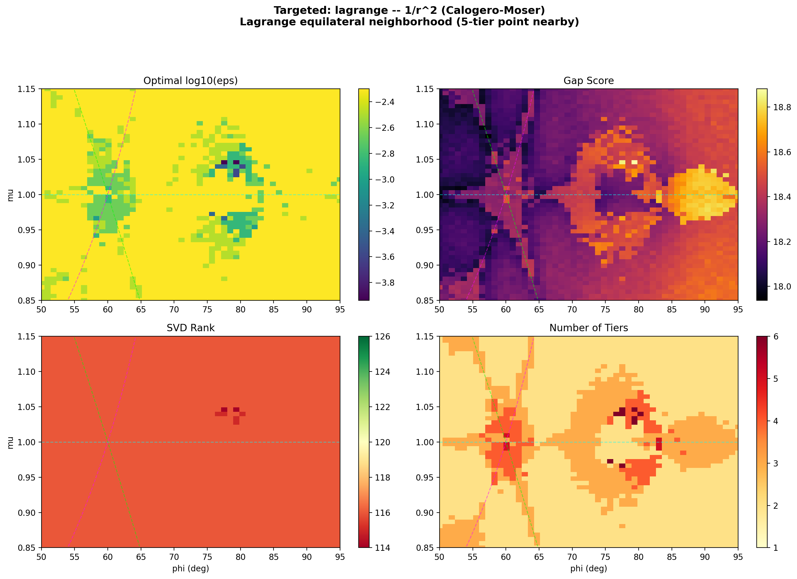

# Pairwise Poisson Algebras of the N-Body Problem

A trilogy of papers studying the Lie algebra generated by pairwise interaction Hamiltonians under the Poisson bracket, covering the dimension sequence, its internal structure, and its universality.

## Papers

| # | Title | File | Status |
|---|-------|------|--------|
| 1 | Super-exponential growth of the Poisson algebra generated by pairwise Hamiltonians of the planar three-body problem | [`preprint.tex`](preprint.tex) | Draft |
| 2 | S₃-equivariant jet filtration of the three-body Poisson algebra: tier decomposition, integer scaling exponents, and syzygy structure | [`paper2_s3_filtration.tex`](paper2_s3_filtration.tex) | Draft |
| 3 | Universal dimension sequences of pairwise Poisson algebras: independence from spatial dimension, potential exponent, and charge sign | [`paper3_universality.tex`](paper3_universality.tex) | Draft |

## Summary of results

### Dimension sequences (Paper 1 + Paper 3)

| N | Sequence | Gap ratio |
|---|----------|-----------|
| 3 | **[3, 6, 17, 116]** (d(4) ≥ 4,501) | > 10¹⁰ at every level |
| 4 | **[6, 14, 62]** | 3.4 × 10¹¹ at level 2 |

The N=3 sequence is:
- **Mass-invariant** — identical across 20+ mass configurations, including Tsygvintsev exceptional cases
- **Potential-invariant** — identical for 1/r, 1/r², and 1/r³ potentials
- **d-independent** — identical at d = 1, 2, 3 spatial dimensions
- **Charge-sign-invariant** — identical for all-attractive, all-repulsive, and mixed Coulomb (helium: +2, −1, −1)

The N=4 sequence is mass-invariant (3 configs) and d-independent (d = 1, 2, 3).

The harmonic potential (r²) produces a finite-dimensional algebra closing at dimension 15.

### The Universality Conjecture (Paper 3)

The dimension sequence depends only on N and the singularity class (singular vs regular) — not on spatial dimension, masses, pole order, or the sign of the interaction.

### Internal structure (Paper 2)

The 116-dimensional level-3 algebra has rigid internal structure. The 156 bracket products decompose as:

### Internal structure: S₃-equivariant jet filtration

The 116-dimensional level-3 algebra has rigid internal structure. The 156 bracket products decompose as:

| Component | Count | ε-scaling | Origin |
|-----------|-------|-----------|--------|
| **Tier 1** | 52 | ε⁰ | E-type irreps of S₃ — zeroth-order observables |
| **Tier 2** | 44 | ε¹ | First-order variation |
| **Tier 3** | 16 | ε² | Second-order variation |
| **Tier 4** | 4 | ε³ | Third-order variation |
| Syzygies | 32 | — | Jacobi identity consequences |
| True zeros | 8 | — | Translation invariance (first-class) |

The scaling exponents are **integer-quantized** (0, 1, 2, 3). The tier sizes are predicted exactly by the Clebsch-Gordan decomposition of S₃ representations: the algebra contains 52 copies of E (standard, dim 2), 24 of A (trivial), and 28 of A' (sign), with E-fraction locked at exactly 2/3 at every bracket level.

The 40 null generators are not Dirac constraints — the 32 syzygies break at special submanifolds (collinear: rank increases to 124), while the 8 true zeros correspond to total-momentum conservation. The tier structure and constraint structure are orthogonal decompositions.

Full analysis: [`potential_comparison_plots/quantization_analysis.md`](potential_comparison_plots/quantization_analysis.md)


*Gap ratio landscape at ε = 10⁻³ comparing all-attractive gravitational 1/r (left) and helium Coulomb +2, −1, −1 (center), with the log₁₀ differential (right). Pearson r = 0.91 confirms charge-sign invariance of the algebraic structure, while the differential reveals charge-sensitive regions near collinear configurations and small mass ratios.*



*High-resolution adaptive scan of the Lagrange equilateral neighborhood (1/r², Calogero-Moser). The optimal sampling scale (top left) drops sharply near the equilateral point (φ ≈ 60°, μ ≈ 1.0), revealing fine algebraic structure invisible at fixed ε. The gap score (top right) shows a pronounced valley around equilateral — the 5-tier point where all four tier boundaries are simultaneously resolved. SVD rank (bottom left) is uniformly 116 except for a few points near (78°, 1.05) where additional syzygies break, while the number of tiers (bottom right) reaches 5–6 in the equilateral cluster and drops to 2–3 at the periphery.*

## Repository structure

### Papers
| File | Description |
|------|-------------|
| `preprint.tex` | Paper 1: dimension sequence, mass invariance, potential comparison |
| `paper2_s3_filtration.tex` | Paper 2: S₃ tier decomposition, jet filtration, syzygies |
| `paper3_universality.tex` | Paper 3: N=4, d-independence, 1/r³, charge-sign invariance, universality conjecture |

### Core computation (N=3)
| File | Description |
|------|-------------|
| `exact_growth.py` | Core symbolic Poisson bracket engine (levels 0–3) |
| `run_cm_exact.py` | Calogero-Moser symbolic verification |
| `potential_comparison.py` | Three-potential comparison (harmonic, Newton, CM) |
| `unequal_mass_study.py` | Mass invariance verification |
| `level4_highsample.py` | Level 4 high-sample computation |
| `aws_level4.py` | Multi-configuration Level 4 pipeline (AWS) |

### Atlas and landscape analysis
| File | Description |
|------|-------------|
| `stability_atlas.py` | Exact-engine atlas scanner |
| `atlas_1000.py` | 1000×1000 full atlas scan |
| `multi_epsilon_atlas.py` | Multi-epsilon & adaptive structure analysis (supports `--charges`, multiprocessing, spot instances) |
| `targeted_adaptive_scan.py` | High-resolution adaptive scans of specific regions (Lagrange, Euler, etc.) |
| `sv_landscape_viz.py` | Singular value landscape visualizations |

### Internal structure analysis (Paper 2)
| File | Description |
|------|-------------|
| `quantization_analysis.py` | Tier structure statistics, hypothesis tests |
| `clebsch_gordan_analysis.py` | S₃ representation decomposition and CG verification |
| `dirac_constraint_test.py` | Epsilon scaling and constraint identification from SVD data |
| `dirac_direct_eval.py` | Direct generator evaluation, null-space analysis |
| `dirac_analysis_from_svd.py` | Comprehensive noise-floor taxonomy (syzygies vs true zeros) |

### N-body and dimension extensions (Paper 3)
| Directory | Description |
|-----------|-------------|
| `nbody/` | N-body engine, N=4 computations, mass/d-independence, 1/r³, helium charge tests |
| `3d/` | d-dimensional engine for N=3, spatial dimension independence |

### Other
| File | Description |
|------|-------------|
| `potential_comparison_plots/` | Analysis figures and documentation |
| `conjectures.md` | Conjecture formulations and evidence tracking |
| `research_roadmap.md` | Prioritized future directions |
| `session_log.md` | Full development log, annotated with corrections |
| `results/` | Numerical results (Level 4 runs, atlas logs) |

## Reproducing results

```bash
pip install -r requirements.txt

# Levels 0–3 (equal masses, ~10 min)
python exact_growth.py

# Mass invariance (~50 min)
python unequal_mass_study.py

# Potential comparison (~30 min)
python potential_comparison.py

# Calogero-Moser verification (~10 min)
python run_cm_exact.py
```

Level 4 computation requires an AWS instance (r6i.4xlarge recommended). See `level4_highsample.py` and `aws_level4.py`.

```bash
# Multi-epsilon atlas scan with charges (helium Coulomb)
python multi_epsilon_atlas.py scan --charges 2 -1 -1

# 1/r² potential with charges
python multi_epsilon_atlas.py scan --potential 1/r2 --charges 2 -1 -1

# Compare charged vs all-attractive for a given potential
python nbody/helium_atlas.py compare --potential 1/r
python nbody/helium_atlas.py compare --potential 1/r2

# Adaptive epsilon scan (finds optimal sampling scale per grid point)
python multi_epsilon_atlas.py adaptive --potential 1/r2
python multi_epsilon_atlas.py adaptive --potential 1/r2 --charges 2 -1 -1

# AWS: parallel adaptive scan with 15 workers, row-range for distributed execution
python multi_epsilon_atlas.py adaptive --potential 1/r2 --workers 15
python multi_epsilon_atlas.py adaptive --potential 1/r2 --start-row 0 --end-row 50 --workers 15
python multi_epsilon_atlas.py adaptive-merge --potential 1/r2
python multi_epsilon_atlas.py adaptive-verify --potential 1/r2

# Targeted high-resolution scans of specific regions
python targeted_adaptive_scan.py --list                    # list regions
python targeted_adaptive_scan.py --region lagrange         # one region
python targeted_adaptive_scan.py --both                    # reference + charged
python targeted_adaptive_scan.py --analyze --potential 1/r2 # generate plots
```

## Key insight

The Calogero-Moser potential — exactly integrable in one dimension — produces the same dimension sequence as the Newtonian potential. This rules out interpreting super-exponential growth as a "non-integrability certificate." The growth is instead a **structural algebraic invariant** of singular pairwise potentials, classifying interactions by singularity type rather than integrability status.  The universality conjecture (Paper 3) formalizes this: the dimension sequence depends only on N and the singularity class.

## Acknowledgments

This work was developed with the assistance of Claude (Opus 4.6), a large language model by Anthropic. Claude contributed the polynomial representation trick (u_ij = 1/r_ij), the computational pipeline, the adversarial review that identified the Calogero-Moser comparison as the decisive test, and all three manuscripts. All mathematical results were independently verified. Full details in `session_log.md`.

## License

This is research code shared for transparency and reproducibility. Please cite the papers if you use it.
