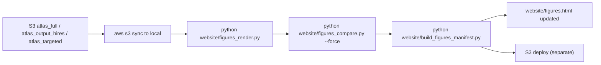

# Atlas Compute Work Order

A worksheet of every atlas scan worth running, with exact CLI invocations,
expected runtimes, S3 paths, and post-completion sync/render commands.

This document is a worksheet, not an automation script. Run jobs one at a
time (or in small batches) when you have the budget, then sync results and
re-render the Figures page (Section 5).

Sections:

- **Section 0** -- quick reference (S3 bucket, AMI, key)
- **Section 1** -- re-runs of partial / failed scans (highest priority)
- **Section 2** -- targeted refinements (one finer-grid scan + render-only items)
- **Section 3** -- interpreting the "noisy" hires 1/r^2 Coulomb sweep
- **Section 4** -- suggested new atlases (tier 1 high-value, tier 2 quantum/neural,
                   tier 3 larger campaigns, tier 4 resolution upgrades low-priority)
- **Section 5** -- post-run pipeline (sync, render, manifest, deploy)


## Section 0: Quick reference

| Setting | Value |
|---|---|
| S3 bucket | `3body-compute-290318` |
| AMI | `ami-05024c2628f651b80` (Amazon Linux 2 with Python 3.8) |
| Key pair | `3body-compute` |
| Security group | `sg-01db2d9932427a00a` |
| IAM profile | `3body-profile` |
| Default instance type | `r6i.4xlarge` (16 vCPUs, 128 GiB) |
| Smaller variant | `r6i.2xlarge` (8 vCPUs) -- used for binary_bh_ns |
| Larger variant | `r6i.8xlarge` (32 vCPUs) -- used for tritium / dusty plasma |
| Default cost (on-demand) | ~$1.00/hr (`r6i.4xlarge`); ~$0.30/hr spot |

**Pre-requisites for each launch:**

```powershell
# Sync the latest code to S3 so EC2 instances pull the up-to-date scanner.
# The userdata scripts pull from s3://3body-compute-290318/code/
aws s3 sync . s3://3body-compute-290318/code/ `
  --exclude "*" `
  --include "*.py" `
  --include "nbody/*.py" `
  --include "*.txt" `
  --exclude ".git/*" --exclude "aws_results/*" --exclude "atlas_*/*" `
  --exclude "figures_v2/*" --exclude "legacy_figures_archive/*" `
  --exclude "checkpoints/*" --exclude "website/*"
```

Run that once per session (or after any `*.py` edit) before launching.

**Post-run sync command pattern (Section 5 covers this in detail):**

```powershell
# After a job completes:
aws s3 sync s3://3body-compute-290318/atlas_full/ aws_results/atlas_full/
python website/figures_render.py --only aws_full --config <name>
python website/build_figures_manifest.py
```


## Section 1: Re-runs (Category A)

Six partial parametric scans plus the all-failed Triple BH (LISA) scan.
All seven need to complete before the corresponding figures can stop showing
"N of 2500 cells unmeasured" annotations.

**Recommended bundle:** the six 50x50 parametric scans share a single launcher
([infra/launch_parametric.py](../infra/launch_parametric.py)) and can all be
relaunched at once. The Triple BH scan needs a custom invocation.

### 1.1 -- Six partial parametric scans

| Config | Local dir | Status | Launcher job |
|---|---|---|---|
| `1r-2` (r^2 harmonic) | `aws_results/atlas_full/1r-2` | grid_n=100, only ~150 of 2500 cells valid (5%) | `para-neg200-neg001` |
| `1r-5` (r^5) | `aws_results/atlas_full/1r-5` | grid_n=50, no summary.json | `para-neg5-neg201` |
| `1r0` (log via 1/r^0) | `aws_results/atlas_full/1r0` | grid_n=50, no summary.json | `para-000-to-100` |
| `1r1p01` (1/r^1.01) | `aws_results/atlas_full/1r1p01` | grid_n=50, no summary.json | `para-101-to-200` |
| `1r2p01` (1/r^2.01) | `aws_results/atlas_full/1r2p01` | grid_n=50, no summary.json | `para-201-to-500` |
| `1r1p61803` (1/r^phi) | `aws_results/atlas_full/1r1p61803` | grid_n=50, no summary.json | `para-special` |

**Suggested edit before relaunching** -- bump the resolution to 100x100 (zero
extra cost is wrong; ~4x runtime per config but produces the canonical-quality
output and removes the Tier 4 resolution-upgrade item later):

In [infra/launch_parametric.py](../infra/launch_parametric.py) line 31:

```python
# Change from:
_COMMON = "--resolution 50 --samples 200 --workers 16 --level 3"
# To:
_COMMON = "--resolution 100 --samples 400 --workers 16 --level 3"
```

If you'd rather keep 50x50 to save compute, leave the line alone -- the figures
pipeline already renders 50x50 grids correctly; the Figures page just labels
them as lower-density data.

**Launch (dry-run first, then live):**

```powershell
# Dry-run: print what would launch without actually doing it
python infra/launch_parametric.py --dry-run --jobs `
  para-neg5-neg201 para-neg200-neg001 para-000-to-100 `
  para-101-to-200 para-201-to-500 para-special

# Live (on-demand, ~$1/hr per instance, 6 instances in parallel)
python infra/launch_parametric.py --jobs `
  para-neg5-neg201 para-neg200-neg001 para-000-to-100 `
  para-101-to-200 para-201-to-500 para-special

# Or spot (~$0.30/hr; SIGTERM-safe checkpointing already wired in)
python infra/launch_parametric.py --spot --jobs `
  para-neg5-neg201 para-neg200-neg001 para-000-to-100 `
  para-101-to-200 para-201-to-500 para-special
```

**Expected runtime per job (16 vCPUs):**

- 50x50: ~30-90 minutes per exponent x ~3-5 exponents per job = ~3-7 hours
- 100x100: ~4x longer = ~12-28 hours per job

The `para-special` job covers all six special exponents (pi, e, phi, etc.) in
one instance, so it's the longest.

**Monitor:**

```powershell
# Live log (refreshed every 2 minutes)
aws s3 cp s3://3body-compute-290318/results/parametric/para-special/live.log -

# Heartbeat (instance health; updated every 2 minutes)
aws s3 cp s3://3body-compute-290318/results/parametric/para-special/heartbeat.json -

# Completion marker (appears when the run finishes)
aws s3 ls s3://3body-compute-290318/results/parametric/para-special/aws_completion.json
```

**Sync + re-render (after each job completes):**

```powershell
# Sync everything from atlas_full back down
aws s3 sync s3://3body-compute-290318/atlas_full/ aws_results/atlas_full/

# Re-render only the affected configs (others are skipped by the resumable script).
# Use --force if you bumped to 100x100 and want to overwrite existing 50x50 outputs.
python website/figures_render.py --only aws_full --force
```

### 1.2 -- Triple BH (LISA): full conditioning failure

| Config | Status |
|---|---|
| `triple_bh_lisa_1r_m1p0_0p01_1e-05` | grid_n=100, **0/10000 cells valid** (every cell failed) |

The masses (1, 0.01, 1e-5) span 5 orders of magnitude, which blew past the SVD
conditioning floor at the default `--samples 400`. The canonical `summary.json`
shows `"valid_points": 0`.

**Custom invocation** -- bump `--samples 1600` and use adaptive epsilon to
let the scanner search for a working epsilon per cell. This is not in
`launch_atlas_instances.py` as a tier; it needs a one-off invocation:

Edit [infra/launch_atlas_instances.py](../infra/launch_atlas_instances.py)
TIER_3 to add a `triple_bh_lisa_v2` entry:

```python
TIER_3 = [
    # ... existing entries ...
    {"job": "atlas-triple-bh-v2",
     "args": "--resolution 100 --scenario triple_bh_lisa --samples 1600 --adaptive --eps-range 1e-6 1e-2 --n-eps 12",
     "instance_type": INSTANCE_TYPE_LARGE},
]
```

Then:

```powershell
python infra/launch_atlas_instances.py --tier 3 --jobs atlas-triple-bh-v2
```

Expected runtime: ~24-48 hours on `r6i.8xlarge` (32 vCPUs); cost ~$30-60.

If even adaptive epsilon fails (extreme mass ratios may genuinely have no
well-conditioned regime at this resolution), accept the "no valid samples"
placeholder card the figures pipeline already produces.

### 1.3 -- Sun-Earth-Moon and Sun-Jupiter-Asteroid: completed but at low rank

These two are **already complete** at 100x100 with `--samples 800` (per
`atlas_output/sun_earth_moon_*/summary.json`); the data shows ranks 91-108
because the extreme mass ratios degrade conditioning. No re-run needed unless
you want to push to `--samples 3200` to chase the missing ranks 109-116; the
returns diminish quickly past 800.

If you want to try anyway:

```powershell
# Edit launch_atlas_instances.py TIER_3 lines 53-54 to bump --samples 800 -> 3200
# Then:
python infra/launch_atlas_instances.py --tier 3 --jobs atlas-sun-earth atlas-sun-jup
```


## Section 2: Targeted refinements (Category B)

### 2.1 -- coulomb_+1_+1_+1 small_mu refinement (one new scan)

**Why:** The existing 30x30 small_mu scan
(`atlas_targeted/coulomb_+1_+1_+1/small_mu/`) shows a real gap-ratio
discontinuity at mu ~ 0.255 (the gap rises ~0.5 dex between mu=0.255 and
mu=0.262). The data is verified clean (900/900 cells valid, 0 failures); we
just need finer mu sampling to characterize the step properly.

**Custom invocation** -- the targeted scanner doesn't currently support a
custom (mu_range, grid_mu) override per region without code changes. Add a new
region entry in [targeted_adaptive_scan.py](../targeted_adaptive_scan.py)
`REGIONS` dict (around line 107):

```python
'small_mu_fine': {
    'description': 'Fine-mu sweep around the mu=0.255 discontinuity (1+1+1 charges)',
    'mu_range': (0.18, 0.32),
    'phi_range_deg': (70, 100),
    'grid_n': (60, 30),     # tuple = (grid_mu, grid_phi)
    'n_samples': 800,
    'n_eps': 12,
    'reason': 'Resolve the gap-ratio step seen in coulomb_+1_+1_+1 small_mu '
              'between mu=0.255 and mu=0.262',
},
```

(`grid_n` already supports the tuple form -- see how `isosceles_ridge` uses
`(10, 80)` on line 101.)

Then either run locally (~10-15 minutes on a workstation):

```powershell
python targeted_adaptive_scan.py --region small_mu_fine --potential 1/r --charges 1 1 1 --workers 12
```

or on EC2 (overkill for a 60x30 patch, but consistent with the other workflows):

Add a userdata entry for `targeted_adaptive_scan.py` -- there isn't a
launch_targeted.py yet; the small_mu refinement is small enough to run on the
local workstation.

### 2.2 -- Re-render-only items (no scan needed)

These configs have clean source data; the only needed action is to re-render
with the current pipeline (already covered by the previous fix pass). No-op if
you've already run `python website/figures_render.py --only targeted` since
the gap_score_map -> gap_map fix:

| Config | Action |
|---|---|
| `1_r3 charge_hotspot` | `python website/figures_render.py --only targeted --config 1_r3 --force` |
| `1_r3 lagrange` | (covered by the same command) |
| `1_r lagrange` | `python website/figures_render.py --only targeted --config 1_r --force` |
| `coulomb_+3_-1_-1 charge_hotspot` | `python website/figures_render.py --only targeted --config coulomb_+3_-1_-1 --force` |
| `coulomb_+1_+1_-1 charge_hotspot` | `python website/figures_render.py --only targeted --config coulomb_+1_+1_-1 --force` |

If they're already correct in `figures_v2/heatmaps/targeted__*` you can skip.


## Section 3: Hires "noise" interpretation

The seven hires `coulomb_1_r2_+2_-1_-1` figures
(`/heatmaps/hires__coulomb_1_r2_+2_-1_-1__*.png`) show scattered dark cells in
the upper-right quadrant (phi > 90 deg, mu around 1.0). **This is real signal,
not a render artifact.**

**What's happening:** the scan was run at six different epsilon values
(eps_5e-04, eps_2e-04, eps_1e-04, eps_2e-03, eps_1e-03, plus the adaptive run).
At smaller epsilon the SVD rank threshold becomes stricter, so cells where the
algebra is marginally close to its closure dimension start dropping below 116.
The dark cells are exactly where the algebra is most sensitive to the
conditioning threshold. This is the BGS spectral signature visualized at the
single-cell level.

**Optional finer epsilon sweep** -- to characterize the threshold transition
more precisely, add intermediate epsilon values:

Edit `multi_epsilon_atlas.py` to add eps in {3e-5, 5e-5, 7e-5} and rerun
locally on a workstation (the existing 100x100 run takes ~20 minutes per
epsilon at `--workers 12`). No EC2 needed.

```powershell
# Existing pattern -- run from repo root
python multi_epsilon_atlas.py --potential 1/r^2 --charges 2 -1 -1 `
  --resolution 100 --eps-range 3e-5 1e-2 --n-eps 12 --workers 12 `
  --output-dir atlas_output_hires
```

**Recommendation:** leave as-is unless a paper draft needs the finer sweep.
The current six-epsilon set already shows the threshold structure clearly.


## Section 4: Suggested new atlases (the "ambitious" set)

Organized by priority. Each entry: scientific motivation, source data needed,
estimated cost, code dependencies.

### 4.1 -- Tier 1 (high value, low cost, ~1-2 days, ~$30 EC2)

#### 4.1.1 -- Tritium / He-3 Yukawa atlas

**Motivation.** The README documents the Yukawa potential survey as confirming
universal `[3, 6, 17, 116]` across nuclear configs. We have zero rendered
atlas figures for nuclear systems.

**Source.** Already a registered scenario in
[nbody/expansion_configs.py](../nbody/expansion_configs.py)
(`tritium_he3`, lines 178-188, `run_atlas: True`).

**Launcher entry.** Already in
[infra/launch_atlas_instances.py](../infra/launch_atlas_instances.py) TIER_4
as `atlas-tritium`.

**Run:**

```powershell
python infra/launch_atlas_instances.py --tier 4 --jobs atlas-tritium
```

**Cost.** `r6i.8xlarge` (32 vCPUs, default for TIER_4), ~6-10 hours, ~$10-20.

#### 4.1.2 -- Dusty plasma Yukawa atlas

**Motivation.** Plasma category in the dataset has Yukawa rows but no figure.
Same universality story as tritium.

**Source.** `dusty_plasma` scenario, already in expansion_configs.py
(line 215, `run_atlas: True`).

**Run:**

```powershell
python infra/launch_atlas_instances.py --tier 4 --jobs atlas-dusty
```

**Cost.** Same as tritium: ~6-10 hours, ~$10-20.

#### 4.1.3 -- Penning trap atlas

**Motivation.** Three equal positive ions in a harmonic trap. Tests whether
external confinement changes the universality class. README claims it doesn't
(landed on `[3, 6, 17, 116]`); the figure should show the same shape-sphere
structure as 1/r equal-charge.

**Source.** `penning_trap` scenario already exists (line 204, `run_atlas: True`).

**Add launcher entry** in `launch_atlas_instances.py` TIER_3:

```python
{"job": "atlas-penning",  "args": "--resolution 100 --scenario penning_trap --samples 400"},
```

**Run:**

```powershell
python infra/launch_atlas_instances.py --tier 3 --jobs atlas-penning
```

**Cost.** ~3-5 hours on `r6i.4xlarge`, ~$5.

#### 4.1.4 -- Composite-potential atlases (1/r + r^2, 1/r + 1/r^2, 1/r + log)

**Motivation.** The README documents L2 algebraic invariants for **13
composite potentials** (under "Structure constant expansion (April 15, 2026)").
Zero atlas figures exist. A handful of canonical composites (gravity + harmonic
confinement, gravity + Calogero, gravity + log) would close the gap.

**Source.** No registered scenarios; need to define new ones in
expansion_configs.py:

```python
"grav_harm": {
    "category": "composite",
    "label": "Gravity + Harmonic Confinement (1/r + r^2)",
    "potential": "composite",
    "potential_params": [(-1, 1), (2, 1)],   # exponent, coefficient pairs
    "masses": {1: Integer(1), 2: Integer(1), 3: Integer(1)},
    "charges": None,
    "external_potential": None,
    "description": "Three equal masses with gravity plus harmonic well",
    "run_atlas": True,
},
"grav_cm": {
    # 1/r + 1/r^2
    ...
},
"grav_log": {
    # 1/r + log(r)
    ...
},
```

(See `kozai_lidov` line 241 for the composite syntax.)

**Run.** After adding scenarios + launcher entries:

```powershell
python infra/launch_atlas_instances.py --tier 3 --jobs atlas-grav-harm atlas-grav-cm atlas-grav-log
```

**Cost.** ~3-5 hours each on `r6i.4xlarge`, ~$5 per composite, ~$15 total.

#### 4.1.5 -- Polynomial r^n grid completion (r^3, r^4, r^6)

**Motivation.** The dataset confirms r^4..r^10 are universal `[3, 6, 17, 116]`
while r^3 is the lone exception (dim 109). We have figures for r^2 (partial),
r^5 (partial). Missing the r^3 boundary case visually.

**Source.** Already supported by `parametric_atlas_scan.py` -- just add the
exponents to a launcher job:

Edit [infra/launch_parametric.py](../infra/launch_parametric.py) PARA_JOBS to
add:

```python
{
    "job": "para-poly-extras",
    "args": "--exponents -3.0 -4.0 -6.0 --resolution 100 --samples 400 --workers 16 --level 3",
},
```

**Run:**

```powershell
python infra/launch_parametric.py --jobs para-poly-extras
```

**Cost.** ~6-9 hours total on `r6i.4xlarge`, ~$10.

### 4.2 -- Tier 2 (quantum + neural, ~3-5 days, ~$80-150 EC2)

#### 4.2.1 -- Moyal-bracket quantum atlases

**Motivation.** The README's quantum extension result is `[3, 6, 17, 117]` for
all singular potentials -- exactly +1 generator at L3 vs the classical
Poisson bracket. **Zero spatial visualization** of where in shape space that
+1 dimension appears, or whether it's uniform.

**Source.** Need a new scanner script (not `full_atlas_scan.py` which is
Poisson-only). The existing quantum infrastructure is in
[`nbody/quantum_algebra.py`](../nbody/quantum_algebra.py) and the launchers
[infra/launch_quantum_rank.py](../infra/launch_quantum_rank.py) +
[infra/userdata_quantum_rank.sh](../infra/userdata_quantum_rank.sh) handle the
Moyal-bracket per-cell rank computation (look for the `__QRANK_ARGS__`
template variable).

**Estimated work to set up** -- new script `quantum_atlas_scan.py` that loops
the per-cell Moyal-bracket dim computation across (mu, phi). Could be cribbed
from `full_atlas_scan.py` with the bracket call swapped.

**Run.** After the new scanner exists, four atlases (1/r, 1/r^2, log, harmonic):

```powershell
# Pseudocode -- requires new launcher
python infra/launch_quantum_atlas.py --tier 1
```

**Cost.** Quantum brackets are ~10x slower than Poisson per cell. At 100x100
that's ~30-50 hours per potential x 4 potentials, ~$50-100 total on
`r6i.4xlarge`.

#### 4.2.2 -- Neural-network coupling atlas (slice)

**Motivation.** The Datasets page shows 21 NN configurations as a bar chart;
we have **zero spatial visualizations**. The 7 universality classes are
defined by coupling type (categorical) but the gradient-coupling class itself
varies continuously with hyperparameters (gradient strength, momentum,
learning rate). A 100x100 grid in any 2D slice through this hyperparameter
space would visualize the class boundaries.

**Source.** [`neural/nn_algebra.py`](../neural/nn_algebra.py) defines the
per-config dim-sequence computation. Need a new wrapper that loops it across
a 2D hyperparameter grid.

**Estimated work to set up** -- ~half a day to write `neural/nn_atlas.py`.

**Run.** Same EC2 pattern as physics atlases.

**Cost.** NN dim-sequence computation is fast (~seconds per config) so a
100x100 atlas is ~3-5 hours on `r6i.4xlarge`, ~$5-8.

#### 4.2.3 -- N=4 1D atlas (mu_12, mu_34) plane

**Motivation.** N=4 has a 6-dimensional shape space; the dataset shows the
sequence is `[6, 14, 62, 1260]`. We have one 1D N=4 file
(`n4_atlas_1d.py` at root) but no 2D visualization. Picking a 2D slice through
the (mu_12, mu_34) plane at fixed isosceles condition (other coords frozen)
would give the first 2D N=4 atlas.

**Source.** `n4_atlas_1d.py` is the starting point. Needs a `n4_atlas_2d.py`
sibling.

**Estimated work to set up** -- ~half a day to extend the 1D scanner.

**Cost.** N=4 has 6-degrees-of-freedom in the algebra so each cell is ~5x
slower than N=3. At 100x100, ~10-20 hours on `r6i.8xlarge`, ~$20.

### 4.3 -- Tier 3 (larger campaigns, ~1-2 weeks)

#### 4.3.1 -- N=4 shape sphere (full 100x100 atlas)

**Motivation.** Same as Tier 2 N=4 but a more meaningful 2D slice: e.g.
project to the natural 2D coordinate analog of (mu, phi) for N=4. The result
is the first published shape-sphere visualization for the four-body algebra.

**Cost.** ~3-5 days compute on `r6i.8xlarge`, ~$100-200.

#### 4.3.2 -- Charge-magnitude continuity (q1 in [1, 5])

**Motivation.** Datasets shows L3 = 116 for He (+2,-1,-1) but L3 = 111 for
Li+ (+3,-1,-1). The transition between q1=2 and q1=3 is unexplored. A sweep
of integer + half-integer q1 (1.0, 1.5, 2.0, 2.5, 3.0, 3.5, 4.0, 4.5, 5.0)
with q2=q3=-1 would reveal whether the L3 drop is sharp at q1=3 or gradual.

**Source.** Need new scenarios in `expansion_configs.py` for half-integer
charges (or extend full_atlas_scan.py to accept floats for `--charges`).

**Cost.** 9 atlases x ~3-5 hours each = ~30-45 hours on `r6i.4xlarge`, ~$30-50.

#### 4.3.3 -- High-resolution Lagrange zoom (200x200)

**Motivation.** The dim-rank phase boundary at the equilateral point (60 deg,
mu=1) is currently visible at 100x100 but pixelated. A 200x200 zoom would
characterize the boundary geometry.

**Source.** Just bump `--resolution 200` in any 1/r scenario; output goes to
the existing `aws_results/atlas_full/` tree. May need a tighter mu/phi range
to keep memory in check.

**Cost.** 200x200 = 4x the points and ~6x runtime per cell at higher
resolution. ~24-36 hours on `r6i.8xlarge`, ~$30-50 per potential.

#### 4.3.4 -- Mass-ratio sweep at fixed shape (50-point)

**Motivation.** Confirms m3 invariance from 1e-3 to 1e+10 at the Lagrange
equilateral point. Already implicitly studied (the dataset's mass_invariance
table) but not visualized as a continuous curve.

**Source.** Local script -- doesn't need EC2. Run `mass_ratio_sweep.py`
(already exists at root) with `--n-points 50`.

**Cost.** ~1 hour on a workstation, ~$0.

### 4.4 -- Tier 4 (low priority): Resolution upgrades for sub-100x100 grids

The figures pipeline already renders any grid shape correctly, so this is
**purely about visual quality, not correctness**. Oddly-shaped grids
(10x80, 30x30, 40x40, 50x50) are fine to leave alone if the data is honest at
that resolution.

**Inventory of all sub-100x100 grids:**

| Grid shape | Count | Source | Recommendation |
|---|---|---|---|
| 50x50 | 8 | `aws_results/atlas_full/{1r-2, 1r-5, 1r0, 1r1p01, 1r2p01, 1r1p61803, 1r2p71828, 1r3p14159}` | Bump to 100x100 as part of the Section 1.1 re-launch (single-line edit to `_COMMON` in `launch_parametric.py`) |
| 50x50 | 11 | `atlas_targeted/*/lagrange/` | Adequate density; only upgrade to 80x80 if dim-rank boundary at the equilateral point needs sharper resolution |
| 40x40 | 33 | `atlas_targeted/*/charge_hotspot/`, `euler_strip/`, `tier_cluster/` | Adequate; the regions are small phase-space windows where 40x40 resolves the structure |
| 30x30 | 11 | `atlas_targeted/*/small_mu/` | The Section 2.1 small_mu_fine refinement covers the science-driven case for charges (1,1,1); leave the others alone |
| 10x80 | 11 | `atlas_targeted/*/isosceles_ridge/` | **Do NOT bump to 100x100.** The 10-row mu axis is intentionally narrow because the ridge geometry is essentially 1D in mu. Maybe 20x80 if you want any mu-perpendicular structure -- but only if you have a specific question. |

**Net recommendation.** Do the 50x50 -> 100x100 upgrade for the 8 parametric
scans (rolled into Section 1.1 at zero extra developer effort) and leave
everything else as-is. Targeted scans don't need higher resolution unless a
specific scientific question warrants finer mesh.


## Section 5: After the runs

The pipeline from "S3 has new data" to "Figures page reflects it":



### 5.1 -- Sync S3 down

```powershell
# Atlas full results (the parametric and named-system scans land here)
aws s3 sync s3://3body-compute-290318/atlas_full/ aws_results/atlas_full/

# Hires (multi-epsilon sweeps; usually run locally not via the EC2 pipeline)
# -- only sync if a hires job was run on EC2
aws s3 sync s3://3body-compute-290318/atlas_output_hires/ atlas_output_hires/

# Targeted scans (small regions)
aws s3 sync s3://3body-compute-290318/atlas_targeted/ atlas_targeted/
```

### 5.2 -- Re-render figures

```powershell
# Per-source if you know what changed:
python website/figures_render.py --only aws_full --force
python website/figures_render.py --only hires --force
python website/figures_render.py --only targeted --force

# Or full re-render (idempotent if no source data changed):
python website/figures_render.py --force
```

### 5.3 -- Re-render comparisons

The 10 curated comparison figures all read from the same source NPYs, so any
new data invalidates them:

```powershell
python website/figures_compare.py --force
```

### 5.4 -- Rebuild the manifest

```powershell
python website/build_figures_manifest.py
```

This walks `figures_v2/` and writes `website/data/figures/manifest.json` --
the source of truth for the Figures page.

### 5.5 -- Deploy (when ready)

The website is served from S3 + CloudFront at `https://nbody.briansheppard.com`
(see `docs/session_log.md` for details). The figure assets currently live
**outside** `website/` (under `figures_v2/`) and are served via the
`ASSET_PREFIX="../"` convention in `website/figures.html`. Two options:

**Option A (current convention):** sync everything separately:

```powershell
# Sync the page + its data manifest
aws s3 sync website/ s3://nbody-briansheppard-com/ --exclude "data/datasets/*.json"

# Sync the figure assets to the bucket root (matches the ../figures_v2/ path)
aws s3 sync figures_v2/ s3://nbody-briansheppard-com/figures_v2/

# Invalidate CloudFront so the new figures appear immediately
aws cloudfront create-invalidation `
  --distribution-id E3AHN5BEM2KUCH `
  --paths "/figures.html" "/data/figures/manifest.json" "/figures_v2/*"
```

**Option B (cleaner):** move `figures_v2/` under `website/` so the bucket
layout is flat. Requires updating `ASSET_PREFIX` in `website/figures.html`
from `"../"` to `""` and re-running the manifest builder. Discuss before
executing.

---

## Appendix: monitoring tips

For a long batch (e.g. all six parametric jobs in parallel):

```powershell
# Check which instances are running
aws ec2 describe-instances `
  --filters "Name=tag:Name,Values=3body-*" "Name=instance-state-name,Values=running" `
  --query "Reservations[*].Instances[*].[InstanceId, InstanceType, Tags[?Key=='Name'].Value|[0], LaunchTime]" `
  --output table

# Tail all live logs at once
$jobs = @("para-neg5-neg201","para-neg200-neg001","para-000-to-100","para-101-to-200","para-201-to-500","para-special")
foreach ($j in $jobs) {
    aws s3 cp s3://3body-compute-290318/results/parametric/$j/heartbeat.json - 2>$null `
        | ConvertFrom-Json | Select-Object job, time, type
}

# Cost estimate for the running fleet
python infra/check_cost.py
```

If a spot instance gets reclaimed mid-run, the SIGTERM handler in
[infra/userdata_full_atlas.sh](../infra/userdata_full_atlas.sh) (line 32) and
[infra/userdata_parametric_atlas.sh](../infra/userdata_parametric_atlas.sh)
(line 32) syncs partial results to S3 before terminating, and the scanner's
checkpoint logic resumes from the last completed row when relaunched.
